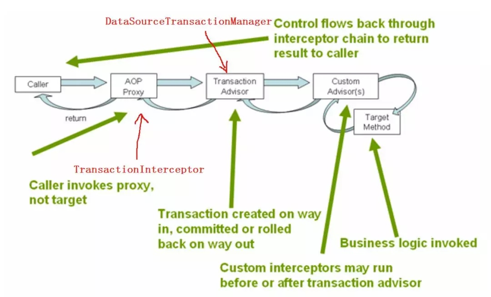

# Spring 事务管理

## 关键类

```java
public interface PlatformTransactionManager {
    TransactionStatus getTransaction(TransactionDefinition definition) throws TransactionException;
    void commit(TransactionStatus status) throws TransactionException;
    void rollback(TransactionStatus status) throws TransactionException;
}
```

事务真正的开始、提交、回滚都是通过PlatformTransactionManager这个接口来实现的，例如，我们常用的org.springframework.jdbc.datasource.DataSourceTransactionManager。

TransactionDefinition用于获取事务的一些属性，Isolation, Propagation，Timeout，Read-only，还定义了事务隔离级别，传播属性等常量。

TransactionStatus用于设置和查询事务的状态，如是否是新事务，是否有保存点，设置和查询RollbackOnly等。

## 声明式事务

所谓声明式事务，就是通过配置的方式省去很多代码，从而让Spring来帮你管理事务。本质上就是配置一个Around方式的AOP，在执行方法之前，用TransactionInterceptor截取，然后调用PlatformTransactionManager的某个实现做一些事务开始前的事情，然后在方法执行后，调用PlatformTransactionManager的某个实现做commit或rollback. 如图：



声明式事务可以通过XML配置，也可以通过Annotation的方式来配置，还可以两种结合。平时项目中看到比较多的是两种结合的方式，在XML中配置数据源，事务管理器，然后AOP相关的通过@Transactional(该注解可以注在Class,Method上)来配置。（个人感觉，AOP相关的配置用XML配置挺繁琐的，还是注解好）例如：

```xml
<!-- 数据源定义,使用dbcp数据源 -->
<bean id="dataSource" class="org.apache.commons.dbcp.BasicDataSource">
    <property name="driverClassName" value="com.mysql.jdbc.Driver"></property>
    <property name="url" value="jdbc:mysql://localhost:3306/test"></property>
    <property name="username" value="root"></property>
    <property name="password" value="ali88"></property>
</bean>

<!--事务管理器-->
<tx:annotation-driven transaction-manager="txManager"/>
<bean id="txManager" class="org.springframework.jdbc.datasource.DataSourceTransactionManager">
    <property name="dataSource" ref="dataSource"/>
</bean>

<!--JDBC模板-->
<bean id="jdbcTemplate" class="org.springframework.jdbc.core.JdbcTemplate">
    <property name="dataSource">
        <ref bean="dataSource" />
    </property>
</bean>
```

```java
@Transactional(readOnly = true)
public class DefaultFooService{
    public Foo getFoo(String fooName) {
        // do something
    }

    @Transactional(readOnly = false, propagation = Propagation.REQUIRES_NEW)
    public void updateFoo(Foo foo) {
        // do something
    }
}
```

## 事务属性

引用官方文档的表格


* value，在有多个事务管理器存在的情况下，用于标识使用哪个事务管理器

* isolation，事务的隔离级别，默认是Isolation.DEFAULT，这个DEFAULT是和具体使用的数据库相关的。关于隔离级别，可以参考MySQL事务学习总结

* readOnly, 是否只读，如果配置了true，但是方法里使用了update，insert语句，会报错。对于只读的事务，配置为true有助于提高性能。

* rollbackFor, noRollbackFor. Spring的声明式事务的默认行为是如果方法抛出RuntimeException或者Error,则事务会回滚，对于其他的checked类型的异常，不会回滚。如果想改变这种默认行为，可以通过这几个属性来配置。

* propagation, 后面会具体讲。

## 事务的传播机制

| 类型 | 说明 |
| :-- | :-- |
| PROPAGATION_REQUIRED | 如果当前没有事务，就新建一个事务，如果已经存在一个事务中，加入到这个事务中。这是 最常见的选择。 |
| PROPAGATION_SUPPORTS | 支持当前事务，如果当前没有事务，就以非事务方式执行 |
| PROPAGATION_MANDATOR | 使用当前的事务，如果当前没有事务，就抛出异常 |
| PROPAGATION_REQUIRES_NEW | 新建事务，如果当前存在事务，把当前事务挂起 |
| PROPAGATION_NOT_SUPPORTED | 以非事务方式执行操作，如果当前存在事务，就把当前事务挂起 |
| PROPAGATION_NEVER | 以非事务方式执行，如果当前存在事务，则抛出异常 |
| PROPAGATION_NESTED | 如果当前存在事务，则在嵌套事务内执行。如果当前没有事务，则执行与 PROPAGATION_REQUIRED 类似的操作 |

其他的都还好理解，后面结合例子重点介绍下PROPAGATION_REQUIRED，PROPAGATION_REQUIRES_NEW，PROPAGATION_NESTED三种传播级别。

表结构和原始数据

```sql
mysql> select * from test;
+----+-------+
| id | money |
+----+-------+
|  3 |   500 |
|  5 |   500 |
|  7 |   600 |
+----+-------+
3 rows in set (0.00 sec)
```

###  PROPAGATION_REQUIRED

```java
@Service
public class MysqlTest01 {
    @Autowired
    private JdbcTemplate jdbcTemplate;
    @Autowired
    private MysqlTest02 mysqlTest02;

    @Transactional
    public void test() {
        jdbcTemplate.execute("update test set money = '501' where id = 3");
        try {
            mysqlTest02.test();
        } catch (Exception e) {
            System.out.println("第二个事务异常");
        }
    }
}

@Service
class MysqlTest02 {
    @Autowired
    private JdbcTemplate jdbcTemplate;

    @Transactional(propagation = Propagation.REQUIRED)
    public void test() {
        jdbcTemplate.execute("update test set money = '502' where id = 3");
        throw new RuntimeException();
    }
}
```

执行完之后，test表的数据没有任何变化。

由于MysqlTest02中的事务传播类型是Propagation.REQUIRED，逻辑上有两个事务，但底层是共用一个物理事务的，第二个事务的抛出RuntimeExcetion导致事务回滚，对于这种传播类型，内层事务的回滚会导致外层事务回滚。所以数据库中的数据没有任何变化。

### PROPAGATION_REQUIRES_NEW

```java
@Service
public class MysqlTest01 {
    @Autowired
    private JdbcTemplate jdbcTemplate;
    @Autowired
    private MysqlTest02 mysqlTest02;

    @Transactional
    public void test() {
        jdbcTemplate.execute("update test set money = '501' where id = 3");
        try {
            mysqlTest02.test();
        } catch (Exception e) {
            System.out.println("第二个事务异常");
        }
    }
}

@Service
class MysqlTest02 {
    @Autowired
    private JdbcTemplate jdbcTemplate;

    @Transactional(propagation = Propagation.REQUIRES_NEW)
    public void test() {
        jdbcTemplate.execute("update test set money = '502' where id = 3");
        throw new RuntimeException();
    }
}
```

同样的代码，唯一的区别就是第二个事务的传播属性改成了REQUIRES_NEW，执行结果是啥？不好意思，第二个事务执行不了。

对于REQUIRES_NEW，逻辑上有两个事务，底层物理上也有两个事务，由于第一个事务和第二个事务更新的是同一条记录，对于Mysql默认的隔离级别REPEATABLE-READ来说，第一个事务会对该记录加排他锁，所以第二个事务就一直卡住了。

OK，我们把第二个事务的执行的SQL语句换成。

```sql
update test set money = '501' where id = 5"
```

执行结果如下，可以看到只有第二个事务回滚了。

```sql
mysql> select * from test;
+----+-------+
| id | money |
+----+-------+
|  5 |   500 |
|  3 |   501 |
|  7 |   600 |
+----+-------+
3 rows in set (0.00 sec)
```

### PROPAGATION_NESTED

对于这种传播类型，物理上只有一个事务，不过可以有多个savePoint用来回滚。当然是用这种传播类型，需要数据库支持savePoint，使用jdbc的也是要3.0版本以上(这个不太确定)。

```java
@Service
public class MysqlTest01 {
    @Autowired
    private JdbcTemplate jdbcTemplate;
    @Autowired
    private MysqlTest02 mysqlTest02;
    @Autowired
    private MysqlTest03 mysqlTest03;

    @Transactional
    public void test() {
        jdbcTemplate.execute("update test set money = '501' where id = 3");
        try {
            mysqlTest02.test();
        } catch (Exception e) {
            System.out.println("第二个事务异常");
        }
        mysqlTest03.test();
    }
}

@Service
class MysqlTest02 {
    @Autowired
    private JdbcTemplate jdbcTemplate;

    @Transactional(propagation = Propagation.NESTED)
    public void test() {
        jdbcTemplate.execute("update test set money = '502' where id = 3");
        throw new RuntimeException();
    }
}

@Service
class MysqlTest03 {
    @Autowired
    private JdbcTemplate jdbcTemplate;

    @Transactional(propagation = Propagation.NESTED)
    public void test() {
        jdbcTemplate.execute("update test set money = '503' where id = 3");
    }
}
```


执行结果是如下，可以看到第一个事务和第三个事务提交成功了，第二个事务回滚了。物理上它们是在一个事务里的，只不过用到了保存点的技术。

```sql
mysql> select * from test;
+----+-------+
| id | money |
+----+-------+
|  5 |   500 |
|  3 |   501 |
|  7 |   601 |
+----+-------+
3 rows in set (0.01 sec)
```
## 其他

在写测试代码的时候遇到了一个关于AOP的问题，可以看到我的测试代码，每个事务都是在一个新的class中写的。为什么不像下面这样写呢？

```java
@Service
public class MysqlTest01 {    
    @Autowired    
    private JdbcTemplate jdbcTemplate;    
    
    @Transactional    
    public void test01() {        
        jdbcTemplate.execute("update test set money = '501' where id = 3");        
        test02();    
    }    
    
    @Transactional    
    public void test02() {        
    jdbcTemplate.execute("update test set money = '501' where id = 5");    
    }
}
```

这是因为在Spring的AOP中，test01调用test02, test02是不会被AOP截获的，所以也不会被Spring进行事务管理。原因是Spring AOP的实现本质是通过动态代理的方式去执行真正的方法，然后在代理类里面做一些额外的事情。当通过别的类调用MysqlTest01中的test01方法时，因为使用了Spring的DI，注入的其实是一个MysqlTest01的一个代理类，而通过内部方法调用test02时，则不是。

[ 转载 ](https://mp.weixin.qq.com/s?__biz=MjM5NzMyMjAwMA==&mid=2651483890&idx=1&sn=a11cd4b321683b5673d0a08657db8689&chksm=bd25028d8a528b9b80dca38852dba6cace08226339125f5cf55adf9132033fba19080d6ae0da&mpshare=1&scene=1&srcid=#rd)[https://mp.weixin.qq.com/s?__biz=MjM5NzMyMjAwMA==&mid=2651483890&idx=1&sn=a11cd4b321683b5673d0a08657db8689&chksm=bd25028d8a528b9b80dca38852dba6cace08226339125f5cf55adf9132033fba19080d6ae0da&mpshare=1&scene=1&srcid=#rd](https://mp.weixin.qq.com/s?__biz=MjM5NzMyMjAwMA==&mid=2651483890&idx=1&sn=a11cd4b321683b5673d0a08657db8689&chksm=bd25028d8a528b9b80dca38852dba6cace08226339125f5cf55adf9132033fba19080d6ae0da&mpshare=1&scene=1&srcid=#rd)